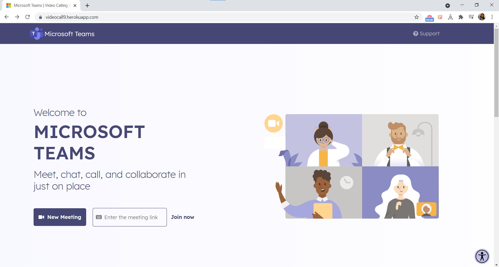
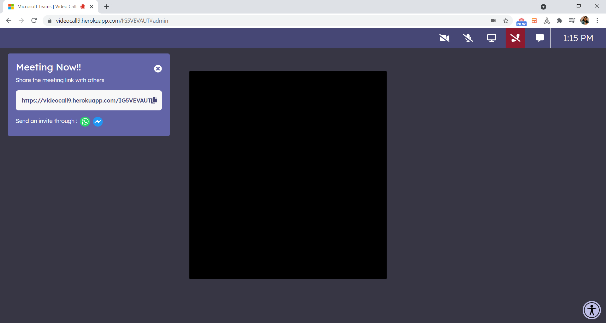
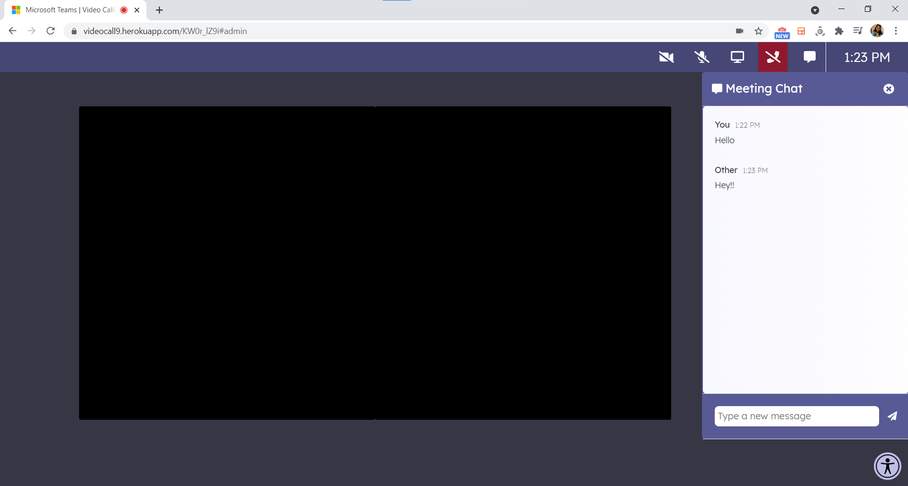
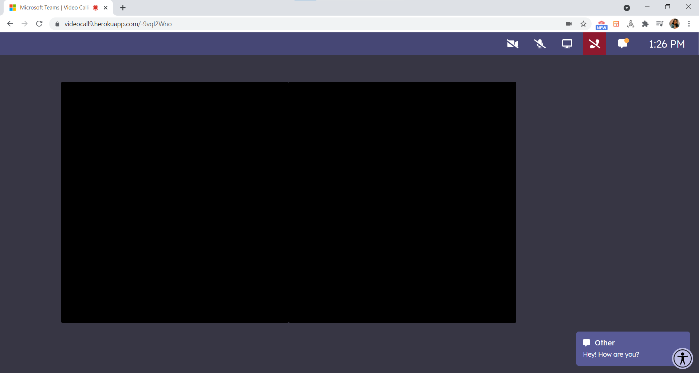
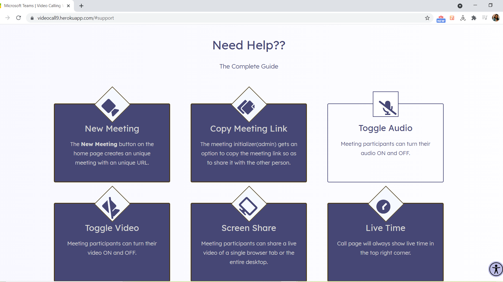
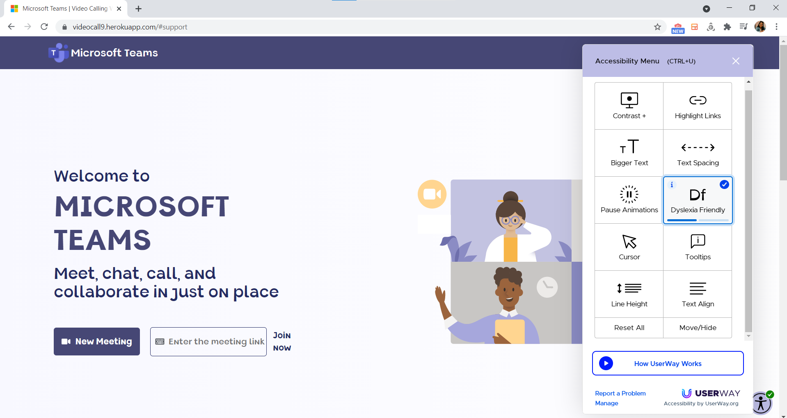
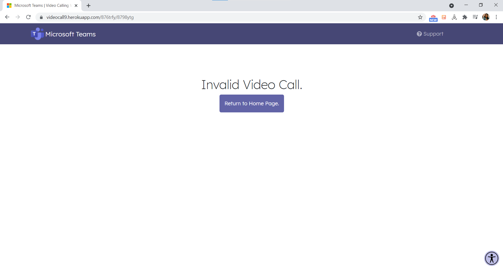

<h1 align="center">Microsoft Teams Clone</h1>
<h3 align="center">Microsoft Engage Mentorship Program 2021</h3>

<!-- TABLE OF CONTENTS -->

  
Table of Contents

  <ol>
    <li>
      <a href="#video-demo">Video Demo</a>
    </li>
    <li>
      <a href="#about-the-project">About The Project</a>
      <ul>
        <li><a href="#built-with">Built With</a></li>
      </ul>
    </li>
    <li><a href="#features">Features</a></li>
    <li><a href="#contact">Contact</a></li>
  </ol>

<!-- VIDEO-DEMO -->
### Video Demo
Go through the video demo of the web application I built <a href="https://www.youtube.com/watch?v=VYrCF-TYgRg">here</a>.

<!-- ABOUT THE PROJECT -->
### About The Project
Developed using the <i>agile development methodology</i>, this is a video conferencing web application that allows two people to have a video/audio call, along with the some add-on features. Agile software development methodology is centered round the idea of iterative development. I have hosted my application on heroku, check it out <a href="https://videocall9.herokuapp.com">here</a>.

<!-- BUILT WITH -->
### Built With
This section should list any major frameworks that you built your project using. Leave any add-ons/plugins for the acknowledgements section. Here are a few examples.
* [JavaScript](https://www.javascript.com)
* [React](https://reactjs.org) for the frontend
* [Node.js](https://nodejs.org/en/docs)-[Express](https://expressjs.com) in the backend 
* [simple-peer](https://www.npmjs.com/package/simple-peer) 
* [Socket.IO](https://socket.io)
* [Redis](https://redis.io) to store the calling info
* and other required dependencies..

<!-- FEATURES -->
### Features
<ul>
  <li>HomePage: User gets two options here<ul><li>Start a new meeting by clicking on "New Meeting"</li><li>Join an existing one by entering the link and clicking on "Join now"</li></ul>
 

  <kbd>
    
  </kbd>
  

  </li>
  <li>On the MeetPage, the initiator of meeting gets a "Meeting Now" popup:<ul><li>User can copy the meeting link and send it to their friend in whatever way they wish.</li>
    <li>Or, send a direct invite through social media(WhatsApp, Messenger) by clicking on the icons in the popup.</li>
       
 

  <kbd>
    
  </kbd>
  

    <li>Video toggling, audio toggling, screen share and leave functionalities are present on the header of the meet page.</li>
    </ul>
  </li>
  <li>By clicking on the chat button on the header, chat window opens up and the two users can have a chat with live timestamp.
   
 

  <kbd>
    
  </kbd>
  

  </li>
  <li>Get a message alert when the other person messages!
   
 

  <kbd>
    
  </kbd>
  

  </li>
  <li>Back on the homepage, by clicking on "Support" on the nav bar, the user can get all the information about all the in-call features.
   
 

  <kbd>
    
  </kbd>
  

  </li>
  <li>
    The Accessibilty Menu - This adds various features so that the applications becomes more accessible for differently abled people.
     
 

  <kbd>
    
  </kbd>
  

  </li>
  <li>Incase someone puts a wrong URL, he/she will be rendered to the following page
  

  <kbd>
    
  </kbd>
  

  </li>
  </ul>

 
<!-- CONTACT -->
### Contact

  &nbsp;&nbsp;
  &nbsp;&nbsp;
  &nbsp;&nbsp;

